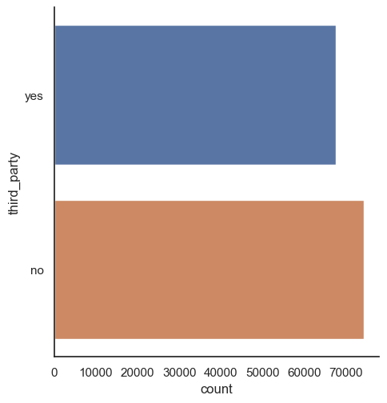
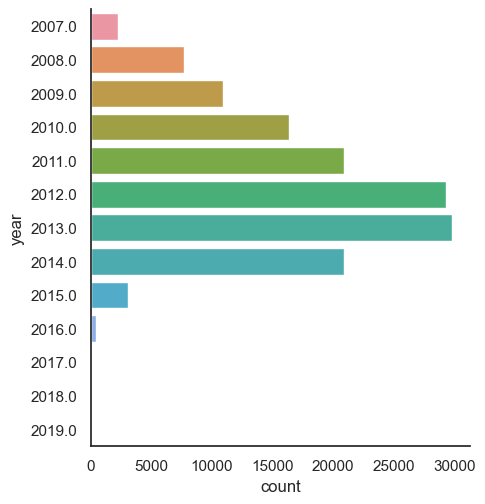
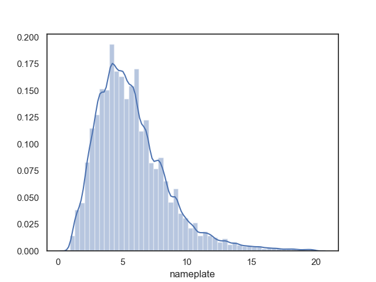
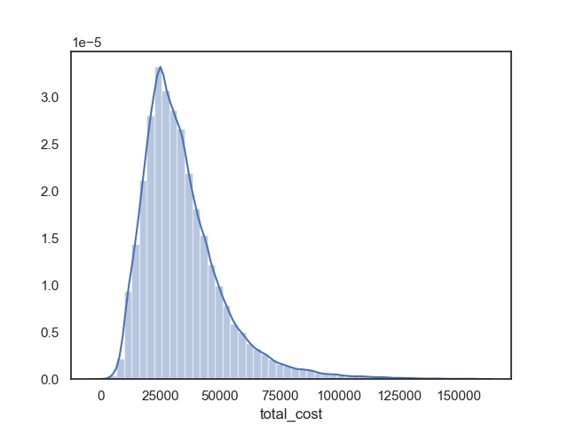
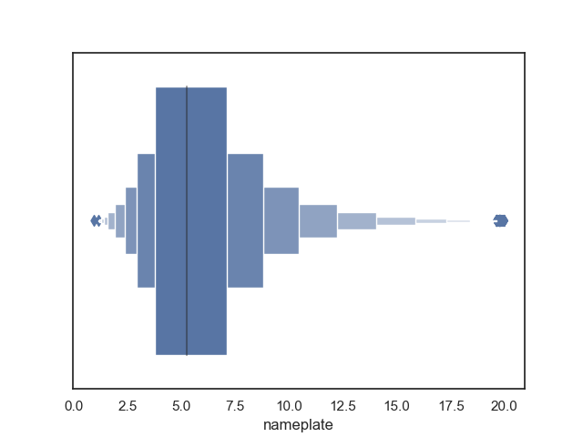
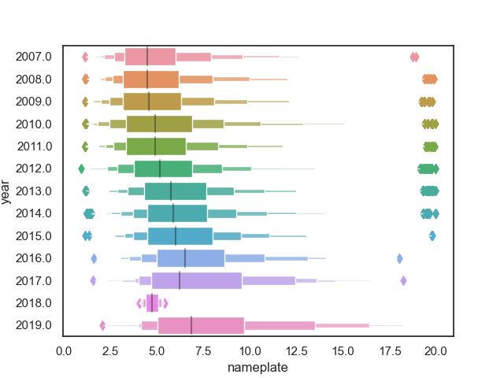
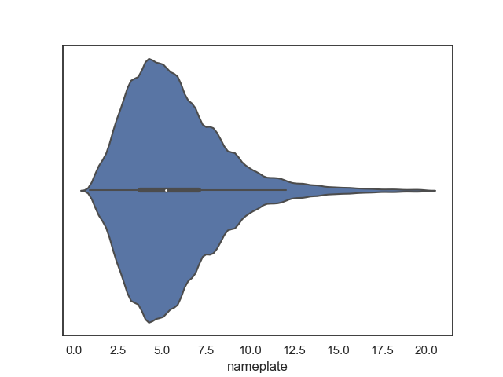
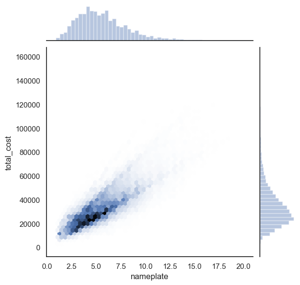
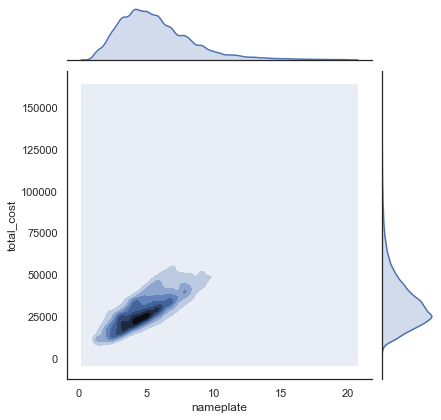

# Example: Data Visualization Using Seaborn, Part I

### Summary

Script `ca_csi_figures.py` demonstrates several ways to visualize 
data using Seaborn and Pandas. The data used comes from the 
California Solar Initiative databank available at the 
URL below. However, a number of the original columns that are 
not used in the examples been omitted.

### Input Data

The input data is file `ca_csi_2020.pkl` in the course Google Drive
folder `x01-seaborn-1`. The original source of the data was
[https://www.californiadgstats.ca.gov/downloads/](
https://www.californiadgstats.ca.gov/downloads/)

### Some of the Examples

#### catplot() with kind='count'

#### distplot()

#### boxenplot() 

#### violinplot()

#### jointplot() with kind='hex'

#### jointplot() with kind='kde'

